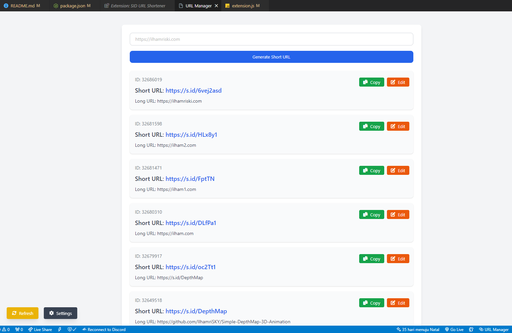

# SID URL Shortener Extension

 

This **SID URL Shortener** extension for Visual Studio Code allows you to generate short URLs using the S.ID API. With this extension, you can quickly create short links and manage them directly from within VS Code. The extension requires authentication through the **S.ID API**, and you must provide your **X-Auth-Id** and **X-Auth-Key** to interact with the API.

## Features
- Generate short URLs directly from VS Code.
- View and manage your created short URLs.
- Easily edit or copy your short URLs.
- Refresh URL list with pagination support.

## Installation

### Prerequisites:
1. **Visual Studio Code**: Make sure you have Visual Studio Code installed on your machine. If not, download and install it from [here](https://code.visualstudio.com/).
2. **Node.js**: Ensure you have Node.js installed for managing dependencies. You can download it from [here](https://nodejs.org/).

### Steps to Install:
1. **Open VS Code**.
2. **Install the Extension**:
    - Go to the **Extensions Marketplace** in VS Code (you can access it by clicking the Extensions icon in the Activity Bar on the side of VS Code).
    - Search for "**SID URL Shortener**" and click **Install**.
3. Once installed, you can start using the extension.

## How to Get Your Credentials (X-Auth-Id and X-Auth-Key)

### S.ID API Credentials:
To use the SID URL Shortener extension, you will need an **X-Auth-Id** and **X-Auth-Key** from the S.ID API.

### Steps to Obtain Your Credentials:
1. Visit the [S.ID website](https://s.id) and log in or create an account.
2. Navigate to the API section of your account.
3. Once logged in, you will find the **API Keys** section, where you can generate your **X-Auth-Id** and **X-Auth-Key**.
4. Copy these values.

## How to Set Your Credentials in VS Code

After installing the extension, follow these steps to enter your credentials:

1. Open the **Command Palette** in VS Code (`Ctrl+Shift+P` or `Cmd+Shift+P`) or click shortcut icon at button right corner.
2. Type `S.ID: Set Auth Credentials` and select it.
3. Enter your **X-Auth-Id** and **X-Auth-Key** in the prompted input boxes.

## How to Use the Extension

Once your credentials are set, you can use the extension to generate short URLs:

### Generate Short URL:
1. Open the **Command Palette** (`Ctrl+Shift+P` or `Cmd+Shift+P`).
2. Type `S.ID: Generate Short URL` and select it.
3. Enter the **Long URL** that you want to shorten. For example, `https://example.com`.
4. The extension will generate a short URL and display it for you to copy or use.

### View Existing Short URLs:
- Click on the **SID URL Shortener** icon in the **Status Bar**.
- A new panel will open showing all the URLs you have shortened. You can also edit or delete them.

### Edit Short URL:
- Click the **Edit** button next to a URL to update the short link.

### Copy Short URL:
- Click the **Copy** button to copy the short URL to your clipboard.

### Refresh URL List:
- Click the **Refresh** button to reload your list of shortened URLs.

## Troubleshooting

- **Invalid Credentials**: If you see an error message about invalid credentials, ensure that you have correctly entered your **X-Auth-Id** and **X-Auth-Key** in the settings.
- **No Response from Server**: If the extension is unable to communicate with the server, check your internet connection and ensure that the S.ID API is up and running.

## Contributing

Feel free to open an issue or pull request if you have suggestions or improvements for the extension.

## License

This extension is licensed under the [MIT License](LICENSE).

---

**SID URL Shortener** is a great tool for quickly shortening URLs without leaving your development environment. We hope this extension helps you streamline your workflow and save time. Enjoy!
